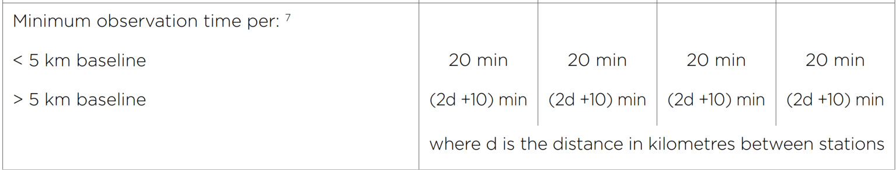

# GNSS-Calibration

This GNSS calibration scheme is partially based on [Technical Specifications for NSW Secondary Control Surveys, New South Wales Government , Spatial Services, Version No. 1.0 April 2021.](https://github.com/phisan-chula/GNSS-Calibration/blob/main/Technical_Specifications_for_NSW_Secondary_Control_Surveys_v1.0.pdf) 
6.1 GNSS Static 
6.1.1. Equipment Specifications 
6.1.2. Observation Procedures 
 
 
<pre>
Scenario       : Flat-baseline Wat Sutat, Bangkok
Reference      : Geod(ellps='WGS84')
Target P2 at   : 13.750000000 100.500000000
                 13°45′00.0″  100°30′00.0″
P1/P2 hae      : -32.000 / -30.000 meter
</pre>
** Table 1 Reference Baseline (decimal degree) **

| baseline   | s12        |   NSWm |       P1_lat |        P1_lng |   P1_hae |       P2_lat |        P2_lng |   P2_hae |       faz1 |       faz2 |
|:-----------|:-----------|-------:|-------------:|--------------:|---------:|-------------:|--------------:|---------:|-----------:|-----------:|
| 2,000.000  | 2,000.009  |     20 | 13.737217130 | 100.486924214 |  -32.000 | 13.750000000 | 100.500000000 |  -30.000 | 44.9968935 | 45.0000000 |
| 5,000.000  | 5,000.024  |     20 | 13.718041487 | 100.467313178 |  -32.000 | 13.750000000 | 100.500000000 |  -30.000 | 44.9922397 | 45.0000000 |
| 10,000.000 | 10,000.050 |     30 | 13.686078561 | 100.434635191 |  -32.000 | 13.750000000 | 100.500000000 |  -30.000 | 44.9844991 | 45.0000000 |
| 20,000.000 | 20,000.106 |     50 | 13.622139509 | 100.369305627 |  -32.000 | 13.750000000 | 100.500000000 |  -30.000 | 44.9690774 | 45.0000000 |
| 30,000.000 | 30,000.174 |     70 | 13.558182901 | 100.304011089 |  -32.000 | 13.750000000 | 100.500000000 |  -30.000 | 44.9537348 | 45.0000000 |
| 40,000.000 | 40,000.261 |     90 | 13.494208790 | 100.238751356 |  -32.000 | 13.750000000 | 100.500000000 |  -30.000 | 44.9384712 | 45.0000000 |
| 50,000.000 | 50,000.373 |    110 | 13.430217231 | 100.173526207 |  -32.000 | 13.750000000 | 100.500000000 |  -30.000 | 44.9232865 | 45.0000000 |
| 60,000.000 | 60,000.515 |    130 | 13.366208277 | 100.108335423 |  -32.000 | 13.750000000 | 100.500000000 |  -30.000 | 44.9081807 | 45.0000000 |
| 70,000.000 | 70,000.695 |    150 | 13.302181982 | 100.043178783 |  -32.000 | 13.750000000 | 100.500000000 |  -30.000 | 44.8931536 | 45.0000000 |
| 80,000.000 | 80,000.918 |    170 | 13.238138400 |  99.978056068 |  -32.000 | 13.750000000 | 100.500000000 |  -30.000 | 44.8782051 | 45.0000000 |

** Table 2  Reference Baseline (degree-minute-second) **

| baseline   | s12        |   NSWm | P1_lat          | P1_lng           |   P1_hae | P2_lat      | P2_lng       |   P2_hae | faz1         | faz2        |
|:-----------|:-----------|-------:|:----------------|:-----------------|---------:|:------------|:-------------|---------:|:-------------|:------------|
| 2,000.000  | 2,000.009  |     20 | 13°44′13.98167″ | 100°29′12.92717″ |  -32.000 | 13°45′00.0″ | 100°30′00.0″ |  -30.000 | 44°59′48.82″ | 45°00′00.0″ |
| 5,000.000  | 5,000.024  |     20 | 13°43′04.94935″ | 100°28′02.32744″ |  -32.000 | 13°45′00.0″ | 100°30′00.0″ |  -30.000 | 44°59′32.06″ | 45°00′00.0″ |
| 10,000.000 | 10,000.050 |     30 | 13°41′09.88282″ | 100°26′04.68669″ |  -32.000 | 13°45′00.0″ | 100°30′00.0″ |  -30.000 | 44°59′04.2″  | 45°00′00.0″ |
| 20,000.000 | 20,000.106 |     50 | 13°37′19.70223″ | 100°22′09.50026″ |  -32.000 | 13°45′00.0″ | 100°30′00.0″ |  -30.000 | 44°58′08.68″ | 45°00′00.0″ |
| 30,000.000 | 30,000.174 |     70 | 13°33′29.45844″ | 100°18′14.43992″ |  -32.000 | 13°45′00.0″ | 100°30′00.0″ |  -30.000 | 44°57′13.45″ | 45°00′00.0″ |
| 40,000.000 | 40,000.261 |     90 | 13°29′39.15164″ | 100°14′19.50488″ |  -32.000 | 13°45′00.0″ | 100°30′00.0″ |  -30.000 | 44°56′18.5″  | 45°00′00.0″ |
| 50,000.000 | 50,000.373 |    110 | 13°25′48.78203″ | 100°10′24.69435″ |  -32.000 | 13°45′00.0″ | 100°30′00.0″ |  -30.000 | 44°55′23.83″ | 45°00′00.0″ |
| 60,000.000 | 60,000.515 |    130 | 13°21′58.3498″  | 100°06′30.00752″ |  -32.000 | 13°45′00.0″ | 100°30′00.0″ |  -30.000 | 44°54′29.45″ | 45°00′00.0″ |
| 70,000.000 | 70,000.695 |    150 | 13°18′07.85514″ | 100°02′35.44362″ |  -32.000 | 13°45′00.0″ | 100°30′00.0″ |  -30.000 | 44°53′35.35″ | 45°00′00.0″ |
| 80,000.000 | 80,000.918 |    170 | 13°14′17.29824″ | 99°58′41.00185″  |  -32.000 | 13°45′00.0″ | 100°30′00.0″ |  -30.000 | 44°52′41.54″ | 45°00′00.0″ |

<pre>
Scenario : Slopy-baseline Doi Intanont, Chiangmai...
Reference : Geod(ellps='WGS84')
Target to P2:  phi lam  faz
18.600000000 98.500000000, -135.000000000 
18°36′00.0″  98°30′00.0″ -135°00′00.0″
Elevation P1/P2 hae : 260.000 / 1393.000 meter
</pre>
** Table 3 Reference Baseline (decimal degree) **

| baseline   | s12        |   NSWm |       P1_lat |       P1_lng |   P1_hae |       P2_lat |       P2_lng |   P2_hae |         faz1 |         faz2 |
|:-----------|:-----------|-------:|-------------:|-------------:|---------:|-------------:|-------------:|---------:|-------------:|-------------:|
| 2,000.000  | 1,647.909  |     20 | 18.610527053 | 98.511041387 |  260.000 | 18.600000000 | 98.500000000 | 1393.000 | -134.9964773 | -135.0000000 |
| 5,000.000  | 4,869.307  |     20 | 18.631103843 | 98.532629446 |  260.000 | 18.600000000 | 98.500000000 | 1393.000 | -134.9895841 | -135.0000000 |
| 10,000.000 | 9,934.319  |     30 | 18.663451678 | 98.566582915 |  260.000 | 18.600000000 | 98.500000000 | 1393.000 | -134.9787278 | -135.0000000 |
| 20,000.000 | 19,965.296 |     50 | 18.727496332 | 98.633863917 |  260.000 | 18.600000000 | 98.500000000 | 1393.000 | -134.9571617 | -135.0000000 |
| 30,000.000 | 29,974.731 |     70 | 18.791378895 | 98.701050955 |  260.000 | 18.600000000 | 98.500000000 | 1393.000 | -134.9355546 | -135.0000000 |
| 40,000.000 | 39,978.822 |     90 | 18.855202750 | 98.768252769 |  260.000 | 18.600000000 | 98.500000000 | 1393.000 | -134.9138719 | -135.0000000 |
| 50,000.000 | 49,980.796 |    110 | 18.918988399 | 98.835491175 |  260.000 | 18.600000000 | 98.500000000 | 1393.000 | -134.8921066 | -135.0000000 |
| 60,000.000 | 59,981.731 |    130 | 18.982742617 | 98.902773598 |  260.000 | 18.600000000 | 98.500000000 | 1393.000 | -134.8702561 | -135.0000000 |
| 70,000.000 | 69,982.091 |    150 | 19.046468270 | 98.970103359 |  260.000 | 18.600000000 | 98.500000000 | 1393.000 | -134.8483194 | -135.0000000 |
| 80,000.000 | 79,982.112 |    170 | 19.110166752 | 99.037482243 |  260.000 | 18.600000000 | 98.500000000 | 1393.000 | -134.8262960 | -135.0000000 |

** Table 4  Reference Baseline (degree-minute-second) **

| baseline   | s12        |   NSWm | P1_lat          | P1_lng          |   P1_hae | P2_lat      | P2_lng      |   P2_hae | faz1           | faz2          |
|:-----------|:-----------|-------:|:----------------|:----------------|---------:|:------------|:------------|---------:|:---------------|:--------------|
| 2,000.000  | 1,647.909  |     20 | 18°36′37.89739″ | 98°30′39.74899″ |  260.000 | 18°36′00.0″ | 98°30′00.0″ | 1393.000 | -134°59′47.32″ | -135°00′00.0″ |
| 5,000.000  | 4,869.307  |     20 | 18°37′51.97384″ | 98°31′57.466″   |  260.000 | 18°36′00.0″ | 98°30′00.0″ | 1393.000 | -134°59′22.5″  | -135°00′00.0″ |
| 10,000.000 | 9,934.319  |     30 | 18°39′48.42604″ | 98°33′59.69849″ |  260.000 | 18°36′00.0″ | 98°30′00.0″ | 1393.000 | -134°58′43.42″ | -135°00′00.0″ |
| 20,000.000 | 19,965.296 |     50 | 18°43′38.98679″ | 98°38′01.9101″  |  260.000 | 18°36′00.0″ | 98°30′00.0″ | 1393.000 | -134°57′25.78″ | -135°00′00.0″ |
| 30,000.000 | 29,974.731 |     70 | 18°47′28.96402″ | 98°42′03.78344″ |  260.000 | 18°36′00.0″ | 98°30′00.0″ | 1393.000 | -134°56′08.0″  | -135°00′00.0″ |
| 40,000.000 | 39,978.822 |     90 | 18°51′18.7299″  | 98°46′05.70997″ |  260.000 | 18°36′00.0″ | 98°30′00.0″ | 1393.000 | -134°54′49.94″ | -135°00′00.0″ |
| 50,000.000 | 49,980.796 |    110 | 18°55′08.35824″ | 98°50′07.76823″ |  260.000 | 18°36′00.0″ | 98°30′00.0″ | 1393.000 | -134°53′31.58″ | -135°00′00.0″ |
| 60,000.000 | 59,981.731 |    130 | 18°58′57.87342″ | 98°54′09.98495″ |  260.000 | 18°36′00.0″ | 98°30′00.0″ | 1393.000 | -134°52′12.92″ | -135°00′00.0″ |
| 70,000.000 | 69,982.091 |    150 | 19°02′47.28577″ | 98°58′12.37209″ |  260.000 | 18°36′00.0″ | 98°30′00.0″ | 1393.000 | -134°50′53.95″ | -135°00′00.0″ |
| 80,000.000 | 79,982.112 |    170 | 19°06′36.60031″ | 99°02′14.93607″ |  260.000 | 18°36′00.0″ | 98°30′00.0″ | 1393.000 | -134°49′34.67″ | -135°00′00.0″ |

